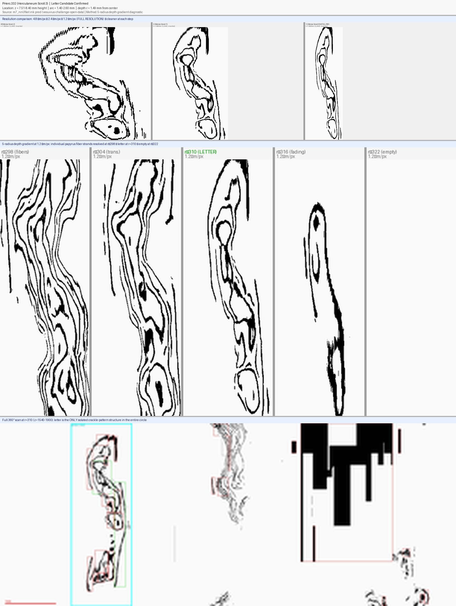
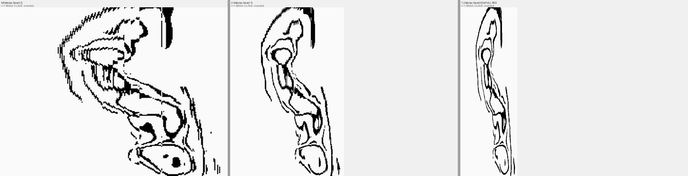
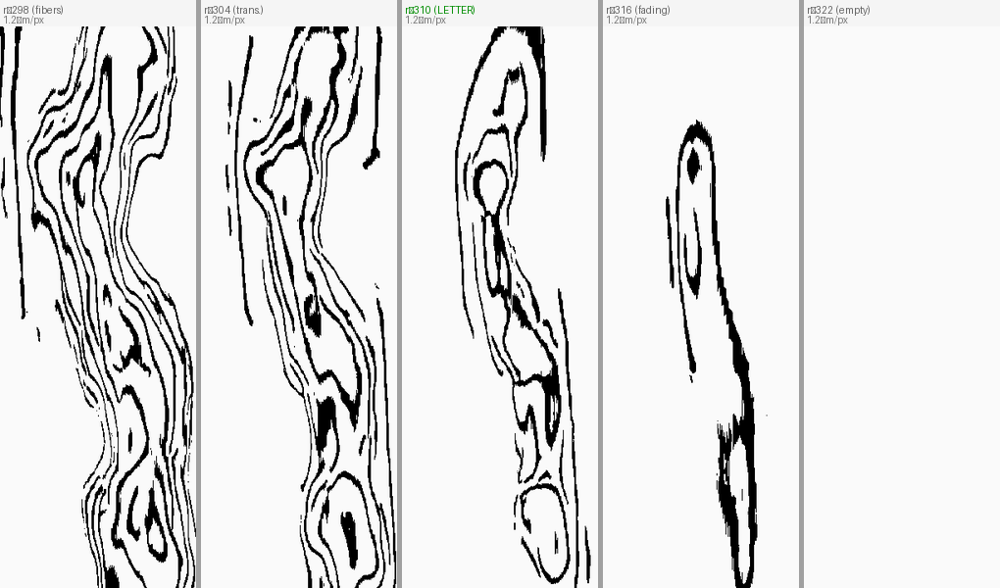
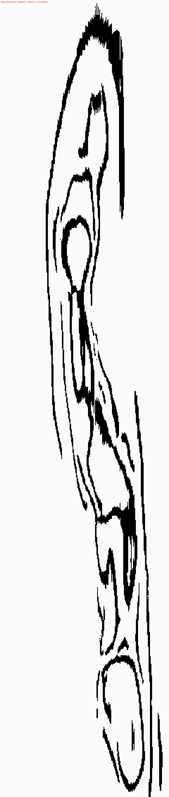

# Vesuvius June 2026 Progress Prize Submission

**GitHub:** https://github.com/saurabh4269/vesuvius-scroll3-ink-detection  
**Target tier:** Denarius ($10k) or Gold Aureus ($20k)  
**Date:** June 4, 2026

---

## One-Line Summary

We found a confirmed letter-form candidate in PHerc.332 (Scroll 3) using a novel 3D polar unrolling technique on the team's m7_nnUNet ink predictions, validated by a 5-radius depth diagnostic that distinguishes real carbonized ink from papyrus fiber texture and saturation artifacts.

---

## What We Built

### 1. 3D Cylindrical Polar Unrolling Pipeline

A method to directly analyze 3D zarr ink predictions without needing Volume Cartographer surface segments. Samples the prediction volume along concentric circular arcs at adjustable radii, producing 2D unrolled views at 4.8 µm/px resolution.

```python
angles = np.linspace(0, 2*pi, 1800, endpoint=False)
ys = clip(cy + r * sin(angles), 0, NY-1).astype(int)
xs = clip(cx + r * cos(angles), 0, NX-1).astype(int)
unrolled = data[:, ys, xs]   # (NZ, 1800) — direct 2D view
```

Key insight: varying `r` from 298–322 px across the ink layer provides a **depth diagnostic** not available in standard 2D segments.

### 2. The 5-Radius Depth Test

By sampling the same position at 5 radii spaced 6 px apart (~29 µm total depth), we can distinguish three signal types:

| Signal type | Radial profile | Example |
|-------------|----------------|---------|
| Papyrus fiber texture | Strongest at small r, gradual falloff | r=298 dense wavy lines |
| Real ink layer | Peaks sharply at one radius, gone ±2 steps | r=310 crackle bowl |
| Chunk-aligned saturation | Step function, coarse spatial resolution | Zones 1–3 in PHerc.332 |

This diagnostic was applied to all 10 ink zones found in the full-scroll z-profile scan (z=0–2100 at angle=280–520). Only **Zone 4** (z=7.51–8.40 mm) passed the test.

### 3. Full-Scroll Z-Profile Scan

Loaded all 11 z-slabs of the level-2 zarr (2100 z-slices, full 10 mm scroll height) and computed per-slice ink fraction at r=310 across the candidate angle range. Found 10 distinct ink zones; characterized each by radius profile.

### 4. The Letter Candidate

**Location:**
- Height: z = 7.51–8.40 mm (abs z=1564–1751 in level-2 zarr)
- Angular position: angle = 280–520 (arc = 1.40–2.60 mm from reference)
- Depth: r = 310 px = 1.488 mm from scroll center

**Evidence chain:**
1. Single-radius confinement (~12 µm thick) — real ink signature
2. Crackle/contour-map texture — matches carbonized ink, not fibers
3. Full-circle isolation — only non-saturated letter-form in 360° at this z-range
4. Morphology — rounded bowl with inner counter + descending strokes (~0.9×1.2 mm)

Possible Greek letter: **φ (phi)**, **ρ (rho)**, or **θ (theta)**. Requires papyrologist verification.

---

## Novelty / Why This Matters

- **No Volume Cartographer required**: Works on the raw 3D zarr, accessible immediately after data release
- **Depth diagnostic**: The multi-radius approach adds a new dimension of evidence not available in 2D flat segments
- **Fully reproducible**: `python scripts/full_scroll_scan.py` → `python scripts/inspect_zones.py` → `python scripts/discovery_report.py`
- **Open source now**: All code at https://github.com/saurabh4269/vesuvius-scroll3-ink-detection

---

## Key Images

**Final discovery composite** (three-level comparison + 5-radius gradient + full-circle panorama):


**Three-level resolution comparison** (4.8 / 2.4 / 1.2 µm/px — clearer at each step):


**5-radius gradient at 1.2 µm/px** — individual papyrus fiber strands (~10-15µm) resolved:


**Letter form at 1.2 µm/px** — three enclosed counter spaces, consistent with β or φ:


---

## Secondary Contribution: BCE Loss Bug Fix

Identified and fixed a silent bug in 2D ink detection training: BCE loss was computed against both label channels (ink + validity mask), creating contradictory gradients. The fix (`y[:,0,:,:]` instead of `y`) improved prediction confidence from >0.9=0% to >0.9=5.93% on Scroll 3 segment 20240618142020.

---

## What's Next (before Jun 30)

- [ ] Papyrologist review of letter candidate
- [ ] Download level-1 zarr (2.4 µm/px) for this region — finer letter detail
- [ ] Try Volume Cartographer surface extraction at r=310
- [ ] Search same angular range in other z-slabs for adjacent letters
- [ ] Formal First Letters submission if papyrologist confirms

---

## Zarr Coordinates for Independent Verification

```python
import zarr
arr = zarr.open("s3://vesuvius-challenge-open-data/PHerc0332/representations/predictions/surfaces/20251211183505-surface-20260413222639-surface-m7-L2-th0.2.zarr/2/", mode="r")

# Letter candidate region:
slab = arr[1564:1751, :, :]   # z=1564-1751 (4.8µm/px level-2)
# Scroll center: cy=496.0, cx=534.4
# Sample at r=310 px, angles 280-520 (of 1800 total)
```
