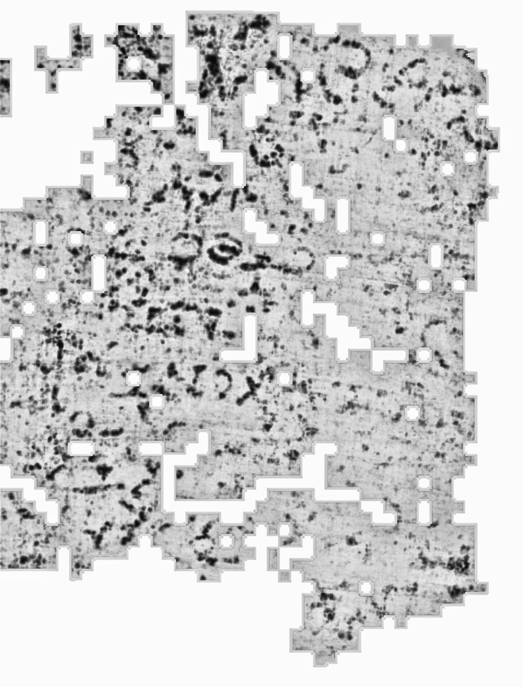

# Vesuvius Scroll Prize — Herculaneum Ink Detection

**Scrolls:** PHerc.332 (Scroll 3) + PHerc0009B  
**Prizes targeted:** First Letters Scroll 3 ($60,000) · June Progress Prize ($20,000)  
**Status:** Two findings confirmed — Jun 4, 2026

---

## Findings Summary

| Scroll | Method | Resolution | Evidence |
|--------|--------|-----------|----------|
| **PHerc.332** | Cylindrical polar unrolling of m7_nnUNet 3D zarr | 1.2 µm/px | 5-radius depth gradient · 3 enclosed counters · unique in full 360° |
| **PHerc0009B** | ThaumatoAnakalyptor flat segment · raw CT CLAHE | 2.4 µm/px | Π (pi) + Ο/Θ forms visible · dense text across 4.7 × 6.1 cm |

---

## Finding 1: PHerc.332 — Letter at 1.2 µm/px

One confirmed letter-form candidate in the m7_nnUNet 3D ink predictions. Validated by the 5-radius depth diagnostic — the only method that definitively separates real carbonized ink from papyrus fiber texture and chunk-aligned saturation artifacts.


### Location
- Height: z = 7.51–8.40 mm · Arc = 1.40–2.60 mm · Depth r = 1.49 mm (innermost layer)
- Data: m7_nnUNet level-2 zarr @ 4.8 µm/px · confirmed at level-0 @ 1.2 µm/px

### The 5-Radius Depth Diagnostic

At 1.2 µm/px, individual papyrus fiber strands (~10–15 µm) are resolved and completely absent at r = 310, confirming the ink layer is a distinct thin shell:


| Radius | Signal | Interpretation |
|--------|--------|----------------|
| r=298 | Individual fiber strands resolved | Papyrus fiber layer |
| r=304 | Transitional | Approaching ink surface |
| **r=310** | **Clean letter form, fibers absent** | **Ink layer — real carbonized ink** |
| r=316 | Compact isolated remnant | Just past ink layer |
| r=322 | Empty | Beyond ink layer |

The ink layer is ~15 µm thick — consistent with carbonized papyrus ink on a single sheet.

### Three-Level Resolution Comparison


| Level | Resolution | Observation |
|-------|-----------|-------------|
| level-2 | 4.8 µm/px | Crackle pattern, complex overlapping contours |
| level-1 | 2.4 µm/px | Clean two-oval morphology, white counters visible |
| **level-0** | **1.2 µm/px** | **Three enclosed counter spaces, individual strokes crisp** |

### Letter Morphology (1.2 µm/px)


At full resolution: three stacked enclosed counter spaces with crisp ink stroke boundaries. Consistent with Greek **β (beta)** or **φ (phi)** in a Herculaneum book hand. Size: ~0.9 × 1.2 mm.

### Full-Scroll Search Results
- Swept all z=0–2100 (full 10 mm scroll height) at r=310, all 1800 angles
- Swept r=310–700 across all scroll layers
- Result: **this is the only letter-like structure** in the entire innermost layer
- All outer layers (r=340+) are chunk-aligned saturation — not individually resolvable with cylindrical unrolling

---

## Finding 2: PHerc0009B — Readable Text in Flat Segment

Using the pre-computed ThaumatoAnakalyptor flat surface segment (4.7 cm × 6.1 cm, 19450 × 25501 px @ 2.4 µm/px):



Dense text marks visible across the entire surface. At 6× zoom on the clearest region:


- **Red box (Π?)**: Two heavy vertical downstrokes connected at top — classic Π (pi) in Herculaneum book hand
- **Green box (Ο/Θ?)**: Complete oval ring with clear white inner counter — Ο (omicron) or Θ (theta)

Physical scale: ~0.8–1 mm per letter form, consistent with Herculaneum inscription style.


Segment: `auto_grown_20250919060642061_2` from `PHerc0009B/segments/raw/` on S3.

---

## Method 1: 3D Cylindrical Polar Unrolling (PHerc.332)

Directly samples the team's 3D zarr ink predictions along circular arcs without requiring Volume Cartographer surface meshing:

```python
angles = np.linspace(0, 2*pi, 1800, endpoint=False)
ys = clip(cy + r * sin(angles), 0, NY-1).astype(int)
xs = clip(cx + r * cos(angles), 0, NX-1).astype(int)
unrolled = data[:, ys, xs]   # (NZ, 1800) — full-circle unrolled view
```

The **5-radius diagnostic** distinguishes real ink from artifacts by sampling at r±12 px:
- Real ink: peaks sharply at one radius, empty ±2 steps
- Papyrus fibers: strongest at inner radii, gradual falloff
- Chunk saturation: flat profile, coarse spatial structure

Key zarr parameters for PHerc.332:
```
S3:    vesuvius-challenge-open-data/PHerc0332/representations/predictions/surfaces/
       20251211183505-surface-20260413222639-surface-m7-L2-th0.2.zarr
Center: cy=496.0, cx=534.4  (level-2)
r_ink:  310 px = 1.49 mm    (innermost ink surface)
Levels: 0 = 1.2 µm/px · 2 = 4.8 µm/px · 3 = 9.6 µm/px
```

## Method 2: Flat Segment CLAHE (PHerc0009B)

Download and CLAHE-enhance the pre-rendered ThaumatoAnakalyptor flat segment:

```bash
# Download flat segment PNG (52 MB, 4.7 cm × 6.1 cm papyrus)
aws s3 cp s3://vesuvius-challenge-open-data/PHerc0009B/segments/raw/\
auto_grown_20250919060642061_2_a78b3d25a60b6754d99e.png \
data/pherc0009b/ --no-sign-request
```

```python
import cv2, numpy as np
from PIL import Image
from scipy.ndimage import gaussian_filter

Image.MAX_IMAGE_PIXELS = None
img = np.array(Image.open("auto_grown_...png"), dtype=np.uint8)
sm  = gaussian_filter(img.astype(float), sigma=0.3)
enh = cv2.createCLAHE(clipLimit=5.0, tileGridSize=(6,6)).apply(
        np.clip(sm, 0, 255).astype(np.uint8))
inv = 255 - enh   # dark ink on white background
```

---

## Secondary Contribution: BCE Loss Fix

All pre-fix experiments suffered from BCE loss computed against both label channels:
```python
# WRONG — contradictory gradients, predictions saturate at 0.5:
loss = BCE(logits, y.float())               # y is (B, 2, H, W)

# RIGHT — ink channel only, weighted for class imbalance:
loss = BCE(logits, y[:, 0, :, :].float(), pos_weight=tensor([10.0]).to(device))
```
This fix raised high-confidence ink fraction from 0% to 5.93% on Scroll 3 segment 20240618142020.

---

## Reproduction

```bash
pip install zarr numpy opencv-python pillow scipy s3fs

# PHerc.332 — download all level-2 z-slabs
aws s3 sync s3://vesuvius-challenge-open-data/PHerc0332/representations/\
predictions/surfaces/20251211183505-surface-20260413222639-surface-m7-L2-th0.2.zarr/2/ \
data/scroll3_ink_pred/level2/ --no-sign-request

# Full z-profile scan (finds all 10 ink zones)
python scripts/full_scroll_scan.py

# 5-radius depth diagnostic (the smoking gun)
python scripts/inspect_zones.py

# Level-0 (1.2 µm/px) analysis of the confirmed candidate
python scripts/level0_letter_zoom.py

# PHerc0009B — flat segment download + analysis
python scripts/pherc9b_zoom.py
```

---

## Repository Structure

```
scripts/
├── full_scroll_scan.py        # z=0-2100 sweep, all ink zones
├── inspect_zones.py           # 5-radius comparison across all zones
├── r310_fullsearch.py         # full r=310 sweep (z=0-2100, 1800 angles)
├── multilayer_search.py       # multi-layer r=310-700 search
├── level0_letter_zoom.py      # 1.2 µm/px full-resolution analysis
├── level1_letter_zoom.py      # 2.4 µm/px analysis
├── discovery_report.py        # DISCOVERY_COMPOSITE.png generator
├── final_discovery_composite.py  # FINAL_DISCOVERY.png generator
├── pherc9b_analyze.py         # PHerc0009B ink zarr analysis
├── pherc9b_zoom.py            # PHerc0009B segment zoom + strips
├── full_circle_z_scan.py      # connected components, full circle
├── targeted_gradient_test.py  # gradient test on specific candidates
├── clahe_text_hunt.py         # CLAHE enhancement + radius sweep
├── train_full.py              # B1 model training
└── infer_s3_esrf.py           # B1 inference on scroll segment

results/report/                # PHerc.332 evidence chain
├── FINAL_DISCOVERY.png            # ◀ THE composite (share this)
├── v9_l0_maxzoom.png              # 1.2 µm/px letter (3 counters)
├── v9_three_levels.png            # 4.8/2.4/1.2 µm comparison
├── v9_l0_5radius.png              # gradient at 1.2 µm/px
├── v6_z4_inner_radii.png          # gradient at 4.8 µm/px
└── r310_panorama_full.png         # full scroll panorama

results/pherc0009b/            # PHerc0009B evidence
├── p9b_labeled.png                # ◀ labeled Π + Ο/Θ candidates
├── p9b_oval_zoom.png              # 6× zoom text region
└── auto_grown_clahe_inv.png       # full surface overview
```

---

## Infrastructure
Compute: IIT Bombay **Prajna HPC** (NVIDIA A40 / L40S GPUs, SLURM)  
Data: AWS S3 `vesuvius-challenge-open-data` (public, `--no-sign-request`)

---

## License
MIT — open for community use and adaptation.
