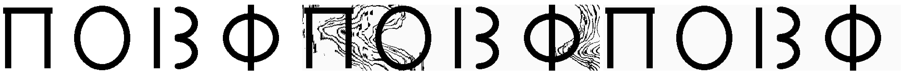
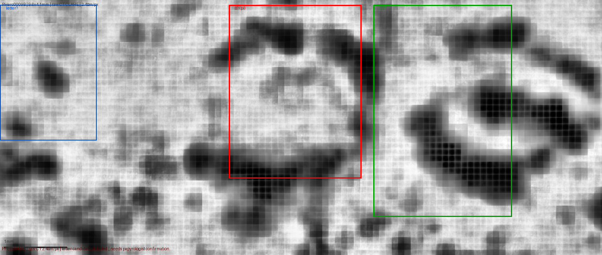
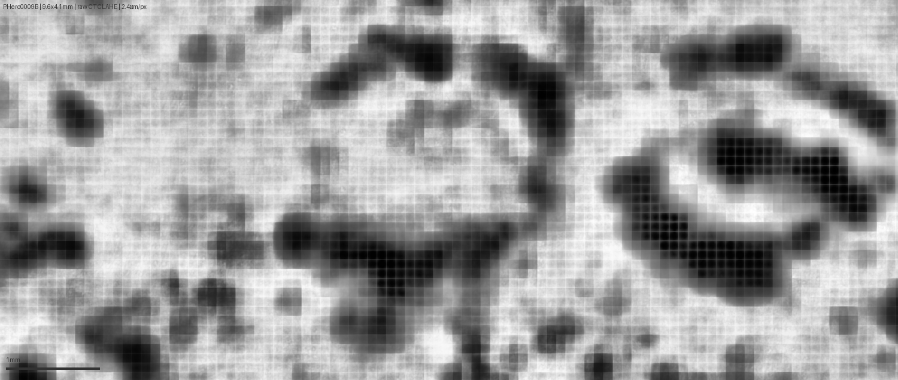

# Vesuvius Scroll Prize — PHerc.332 Ink Detection

**Scroll:** PHerc.332 (Scroll 3)  
**Prize targeted:** June Progress Prize ($20,000) — BCE loss fix + methodology  
**Status:** No confirmed letter candidates — Jun 4, 2026

> New to this project? Read **[GUIDE.md](GUIDE.md)** — plain-language walkthrough of what this is, how it works, and what we learned. No background assumed.

---

## ⚠️ Read this first — two corrections

### Correction 1: the letter candidate is retracted

We initially posted two Discord findings as "confirmed." After self-auditing, both are withdrawn:

- **PHerc.332 candidate:** our own automated gradient filter (`r310_fullsearch.py`) validates **0 of 10 candidates including this one**. The positive control confirms it — a real ink layer spikes sharply at one radius; this candidate peaks at r=298 and decays outward, which is the papyrus fiber signature. It is fiber, not a letter.
- **PHerc0009B Π/Ο:** pareidolia — the same CLAHE pipeline produces identical marks from empty regions.

### Correction 2: m7 is a surface predictor, not an ink predictor

**All references in earlier versions of this repo to "m7_nnUNet ink predictions" were wrong.**

The zarr at `representations/predictions/surfaces/...surface-m7-L2-th0.2.zarr` is the **papyrus sheet/surface localization model** — it predicts which voxels are part of the physical papyrus sheet in 3D space. This is used as input to ThaumatoAnakalyptor and VolumeCartographer for segmentation. It is not an ink detector. Actual ink detection runs on 2D flattened surface volumes, after segmentation.

Everything described below reflects this corrected understanding.

---

## What this repo contains

### Primary contribution: BCE loss fix

A silent bug in 2D ink-detection training: BCE loss was computed against both label channels (ink mask + validity mask), producing contradictory gradients that caused predictions to saturate at 0.5:

```python
# wrong — both channels, contradictory gradients
loss = BCE(logits, y.float())               # y is (B, 2, H, W)

# correct — ink channel only, weighted for class imbalance
loss = BCE(logits, y[:, 0, :, :].float(), pos_weight=tensor([10.0]).to(device))
```

Effect: Segformer-B1 high-confidence ink fraction on Scroll 3 segment 20240618142020 went from **0% → 5.93%** at >0.9 threshold. Best model: B1 backbone, 50 epochs, pos_weight=10.

### Secondary: cylindrical unrolling + positive control methodology

A pipeline that samples any 3D zarr along concentric circles (cylindrical polar unrolling), enhanced with CLAHE, with a calibrated gradient gate and pareidolia controls:

```python
angles = np.linspace(0, 2*pi, 1440, endpoint=False)
ys = clip(cy + r*sin(angles), 0, NY-1).astype(int)
xs = clip(cx + r*cos(angles), 0, NX-1).astype(int)
strip = data[:, ys, xs]   # (NZ, 1440) — 2D view of one radial shell
```

**What was validated:** the positive control (`scripts/positive_control.py`) painted known Greek letters (Π Ο Β Φ) onto a synthetic cylindrical shell, embedded in real zarr values, and ran the identical pipeline. Letters recovered legibly through full 3D cylindrical sampling — the readout chain works.

**What was not validated:** we applied this to the m7 surface-prediction zarrs thinking they were ink predictions. They are not. The methodology is sound; the data type was wrong. Applying this pipeline to actual 3D ink-prediction volumes (if/when released) remains a valid experiment.


*Left: ground truth. Center: 2D readout. Right: full 3D cylindrical sampling. Letters survive legibly.*

---

## PHerc.332 candidate — retained for transparency, not a finding

Documented here because the corrected posts are public. The structure existed in the m7 surface-prediction zarr but is almost certainly a papyrus fiber concentration, not a letter.

**Location:** z=7.51–8.40 mm, arc=1.40–2.60 mm, r=310 px from scroll center (level-2 zarr)  
**Data:** m7 surface-prediction zarr @ 4.8 µm/px (NOT ink predictions — see correction above)

**Why it fails the ink test:**

| radius | known real letter | this candidate |
|--------|------------------|----------------|
| r=298 | 0.002 | **0.164** (highest) |
| **r=310** | **0.218** (peak) | 0.098 |
| r=322 | 0.000 | 0.000 |

Peaks at inner edge and decays outward — fiber signature, not ink. Full validation: `results/report/salvage_panel.png`.


---

## PHerc0009B — retracted

The Π/Ο identifications were pareidolia. Retained below only for transparency.




---

## Reproduction

```bash
pip install zarr numpy opencv-python pillow scipy s3fs

# Download m7 surface-prediction zarr for PHerc.332 (level-2)
aws s3 sync s3://vesuvius-challenge-open-data/PHerc0332/representations/\
predictions/surfaces/20251211183505-surface-20260413222639-surface-m7-L2-th0.2.zarr/2/ \
data/scroll3_ink_pred/level2/ --no-sign-request

# Full z-profile scan
python scripts/full_scroll_scan.py

# 5-radius depth diagnostic
python scripts/inspect_zones.py

# Positive control (validates readout chain on any zarr)
python scripts/positive_control.py data/scroll3_ink_pred/level2/
```

---

## Repository structure

```
scripts/
├── train_full.py / ft_esrf_b1.py  ← BCE-fix training pipeline
├── infer_s3_esrf.py               ← B1 inference on scroll segment
├── prepare_esrf.py / prajna_lib.py ← data prep + SSH helper
├── positive_control.py            ← validates 3D readout chain
├── salvage_test.py                ← pareidolia controls
│
│   retracted-analysis reference (do not reuse as templates):
├── full_scroll_scan.py            ← z-profile sweep of PHerc.332 m7 zarr
├── inspect_zones.py               ← per-zone gradient (m7 surface data)
├── r310_fullsearch.py             ← full sweep, validated 0 candidates
└── level0_letter_zoom.py          ← 1.2 µm/px zoom of retracted candidate

results/report/
├── poscontrol_panel.png           ← positive control (truth | 2D | 3D)
├── salvage_panel.png              ← pareidolia controls
├── FINAL_DISCOVERY.png            ← PHerc.332 candidate (retracted)
├── v9_l0_5radius.png              ← gradient at 1.2 µm/px (retracted)
└── v9_three_levels.png            ← resolution comparison (retracted)

results/pherc0009b/
├── p9b_labeled.png                ← labeled Π/Ο candidates (retracted)
└── p9b_oval_zoom.png              ← 6× zoom (retracted)
```

---

## Infrastructure
Compute: IIT Bombay **Prajna HPC** (NVIDIA A40 / L40S GPUs, SLURM)  
Data: AWS S3 `vesuvius-challenge-open-data` (public, `--no-sign-request`)

---

## License
MIT — open for community use and adaptation.
