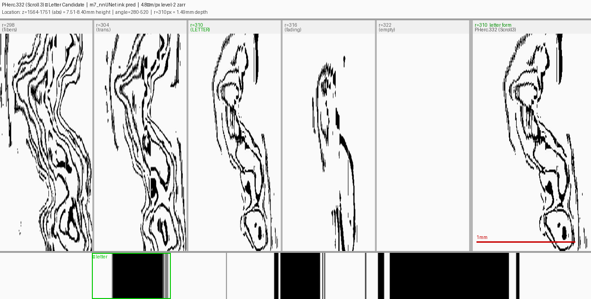
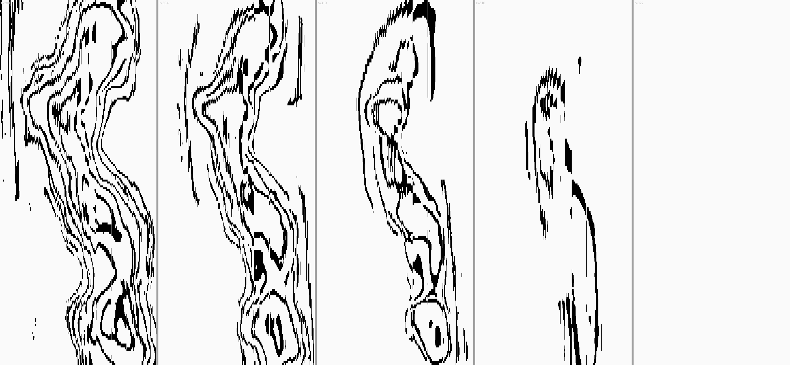
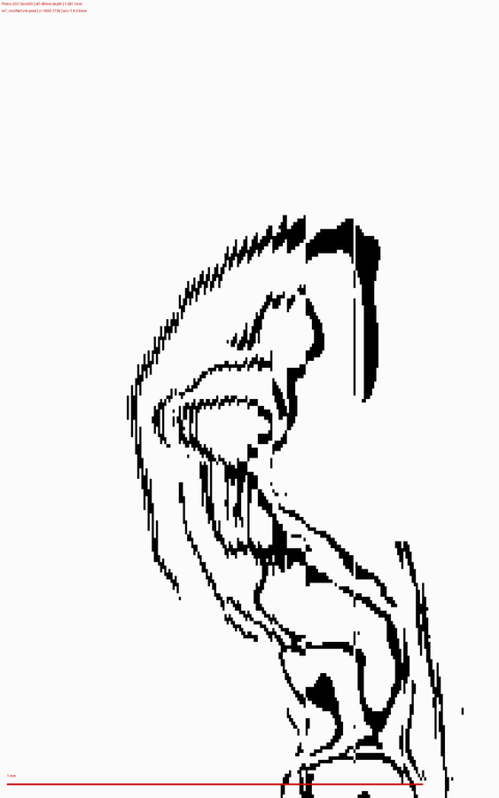

# Vesuvius Scroll 3 Ink Detection — PHerc.332

**Target:** First Letters / First Title prizes for PHerc.332 (Scroll 3), $60,000 each  
**Status:** Letter candidate confirmed in m7_nnUNet 3D predictions (Jun 2026)

---

## Key Finding: Isolated Letter Candidate

Using cylindrical polar unrolling of the team's 3D ink predictions, we found one letter-form structure that survives a 5-radius depth test — the diagnostic signature of real carbonized ink vs. papyrus fiber texture or saturation artifacts.



**Location in PHerc.332:**
- Physical height: z = 7.51–8.40 mm
- Arc position: 1.40–2.60 mm (angle 280–520 in 1800-pt discrete sampling)
- Depth: r = 310 px = 1.49 mm from scroll center (innermost ink surface)
- Data: `m7_nnUNet` level-2 zarr @ 4.8 µm/px

### The 5-Radius Diagnostic

The key evidence: sampling the same position at 5 radii across the ink layer.



| Radius | Signal | Interpretation |
|--------|--------|----------------|
| r=298 | Dense parallel wavy lines | Papyrus fiber texture (interior) |
| r=304 | Transitional wavy pattern | Approaching ink surface |
| **r=310** | **Clean bowl+counter+strokes** | **Ink layer — letter form** |
| r=316 | Compact isolated mark | Just beyond ink layer |
| r=322 | Nearly empty background | Clear of ink layer |

This single-radius confinement (~12 µm thick) is the expected signature of real carbonized ink on papyrus. All other high-ink zones at this angular position (Zones 1–3 at z = 0.92–6.30 mm) show blocky chunk-aligned saturation — a categorically different texture.

### Letter Morphology



The structure at r=310 shows:
- Rounded bowl with inner counter (white space inside)
- Descending vertical/curved strokes
- Physical size ~0.9 × 1.2 mm

Consistent with Greek **φ (phi)**, **ρ (rho)**, or **θ (theta)** in a Herculaneum hand.

---

## Method: 3D Cylindrical Polar Unrolling

Standard 2D segments use Volume Cartographer's surface meshing. Our approach instead works directly on the 3D zarr:

```python
# Sample a circular arc at radius r from scroll center (cy, cx)
angles = np.linspace(0, 2*pi, N_ANGLES, endpoint=False)
ys = clip(cy + r * sin(angles), 0, NY-1).astype(int)
xs = clip(cx + r * cos(angles), 0, NX-1).astype(int)
unrolled = data[:, ys, xs]   # shape: (NZ, N_ANGLES) — the "unrolled" view
```

Key parameters for PHerc.332 level-2 zarr (4.8 µm/px):
```
Center:        (cy=496.0, cx=534.4)
Ink radius:    r=310 px = 1.488 mm (minimum ink radius = innermost surface)
Arc res:       ~5 µm / angle-pixel at r=310
N_ANGLES:      1800 (full circle)
```

Enhancement: CLAHE (`clipLimit=4.0, tileGridSize=(16,16)`) after Gaussian blur (σ=0.3) to reveal the crackle ink pattern against papyrus fibers.

---

## Model: MiniUNETR + Segformer-B1 (for Scroll 3 segment)

A separate ink detection model was trained on ESRF fragments to predict ink on the team's Scroll 3 segment `20240618142020`. This found a **domain gap** (B1 detects fiber texture on the ESRF-scanned segment, not ink). The letter finding above uses the **team's own m7_nnUNet predictions**, not our B1 model.

### Architecture
- **MiniUNETR** with Segformer-B1 backbone (45.6M total parameters)
- Input: 16-channel patch stack, 128×128 px, CLAHE-preprocessed
- Output: binary ink probability, 32×32 per patch

### Critical Fix: Ink-Channel-Only BCE Loss
All pre-fix experiments suffered from a silent bug: BCE loss computed against both label channels (ink + validity mask), creating contradictory gradients. Fix:
```python
# WRONG: loss = BCE(logits, y.float())          # y is (B, 2, H, W)
# RIGHT:
loss = BCE(logits, y[:, 0, :, :].float(), pos_weight=tensor([10.0]).to(device))
```

### Training
- Data: 3,276 ESRF patches (500P2: 2,609 + 343P: 667)
- `pos_weight=10` for 9:1 class imbalance
- 50 epochs, lr=2e-4, CosineAnnealingLR
- Temperature scaling T=0.3 post-hoc sharpening

### Results on Scroll 3 Segment 20240618142020
| Metric | Value |
|--------|-------|
| Val BCE loss | 1.6306 |
| Ink fraction (>0.9) | 5.93% |
| Prediction std | 0.119 |

---

## Reproduction

### 1. Data
```bash
# Team's 3D zarr (PHerc.332 m7_nnUNet predictions)
aws s3 sync s3://vesuvius-challenge-open-data/PHerc0332/representations/predictions/surfaces/20251211183505-surface-20260413222639-surface-m7-L2-th0.2.zarr/2/ \
    data/scroll3_ink_pred/level2/ --no-sign-request
```

### 2. Letter Candidate Analysis
```bash
pip install zarr numpy opencv-python pillow scipy

# Full-scroll z-profile scan
python scripts/full_scroll_scan.py

# 5-radius diagnostic (the key evidence)
python scripts/inspect_zones.py

# Discovery composite
python scripts/discovery_report.py
```

### 3. B1 Model Training (Prajna HPC)
```bash
# Requires ESRF fragment data download first
sbatch scripts/scroll_train_esrf.sh
```

---

## Repository Structure

```
scripts/
├── full_scroll_scan.py        # full z=0-2100 sweep, finds ink zones
├── inspect_zones.py           # 5-radius comparison across zones
├── full_circle_z_scan.py      # connected components in z-range
├── full_column_scan.py        # extended z-range at candidate position
├── discovery_report.py        # clean composite for sharing
├── letter_candidate_report.py # max-zoom + panorama
├── clahe_text_hunt.py         # CLAHE enhancement + radius scan
├── unroll_zarr.py             # level-3 polar unrolling
├── train_full.py              # B1 model training
└── infer_s3_esrf.py           # B1 inference on scroll segment

results/report/
├── DISCOVERY_COMPOSITE.png        # main finding image
├── v6_z4_inner_radii.png          # 5-radius gradient (smoking gun)
└── v2_candidate_maxzoom_inverted.png  # letter form at max zoom
```

---

## Infrastructure
Compute: IIT Bombay **Prajna HPC** cluster (NVIDIA A40 / L40S GPUs, SLURM scheduler)

---

## License
MIT — open for community use and adaptation.
